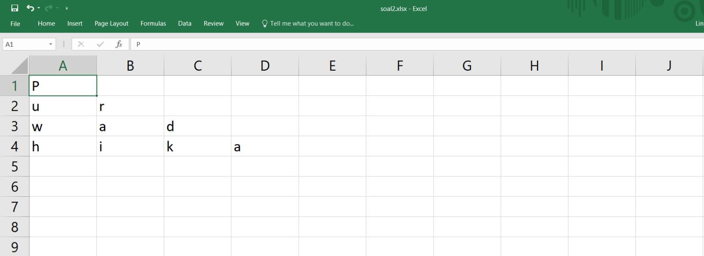
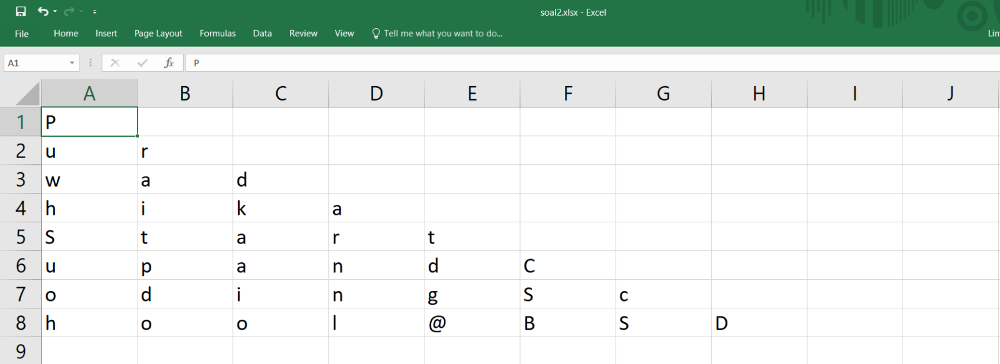
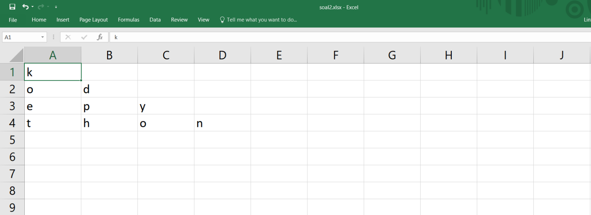

# Soal Ujian Python Data Science Fundamental


<hr>

### **Soal 1 - 🆒 Mengurai & Merajut Kata**

Buatlah sebuah __file python (*.py*)__ yang berisi sebuah __class__ dengan __2 buah method__, yaitu __urai(*string*)__ dan __rajut(*string*)__. Dengan __class__ tersebut, buatlah sebuah __object__ yang dapat digunakan untuk mengurai & merajut sebuah __string__.

```python
# buat sebuah class dengan 2 method
class uraiRajutKata:
    def urai(...):
        ...
    def rajut(...):
        ...

# buat sebuah object
x = uraiRajutKata()
```

- Method __urai(*string*)__ akan mengurai string. Adapun cara pemanggilan method __urai(*string*)__ dan contoh output yang diharapkan adalah sebagai berikut:

    ```python
    print(x.urai('Code'))
    print(x.urai('Python'))
    print(x.urai('Purwadhika'))

    # Output:
    CCoCodCode
    PPyPytPythPythoPython
    PPuPurPurwPurwaPurwadPurwadhPurwadhiPurwadhikPurwadhika
    ```

- Sedangkan method __rajut(*string*)__ akan merajut kembali string yang terurai menjadi bentuk kata asalnya. Adapun cara pemanggilan method __rajut(*string*)__ dan contoh output yang diharapkan adalah sebagai berikut:

    ```python
    print(x.rajut('CCoCodCode'))
    print(x.rajut('PPyPytPythPythoPython'))
    print(x.rajut('PPuPurPurwPurwaPurwadPurwadhPurwadhiPurwadhikPurwadhika'))
    
    # Output:
    Code
    Python
    Purwadhika
    ```

_**Catatan:**_ 

✅ Commit & push source code jawaban soal ini ke __Github__ Anda, buatlah repo dengan nama __Ujian_UraiRajutKata__, kemudian lampirkan __url link repo Github__ Anda via email ke _lintang@purwadhika.com!_

<hr>

### **Soal 2 - 🔺 Segitiga Excel**

Buatlah __sebuah file python__ (*.py*) yang mengandung __sebuah function__ dengan __1 parameter__, yang dapat membentuk pola segitiga di sebuah __file Excel/Spreadsheet__ (*.xlsx*) dengan elemen berupa karakter-karakter dari sebuah __string__ yang menjadi parameter function tersebut. Info selengkapnya silakan ikuti case flow beserta output yang diharapkan berikut ini.

- __Case Flow__: Saat dieksekusi, program akan mencetak pola segitiga dari karakter-karakter string yang diinputkan, di sebuah file Excel. Jika jumlah karakter string memenuhi syarat terbentuknya pola, maka program akan menjalankannya. Namun jika jumlah karakter string tidak memenuhi syarat membentuk pola, maka akan muncul pesan bahwa string tidak memenuhi syarat membentuk pola.

    ```python
    segitigaExcel('Purwadhika')
    segitigaExcel('Purwadhika Startup and Coding School @BSD')
    segitigaExcel('kode')
    segitigaExcel('kode python')
    segitigaExcel('Lintang')
    ```

- __Output__ yang diharapkan:
    
    ```bash
    # segitigaExcel('Purwadhika')
    ```
    

    <hr>

    ```bash
    # segitigaExcel('Purwadhika Startup and Coding School @BSD')
    ```
    

    <hr>
    
    ```bash
    # segitigaExcel('kode')
    Mohon maaf, jumlah karakter tidak memenuhi syarat membentuk pola.
    ```

    <hr>

    ```bash
    # segitigaExcel('kode python')
    ```
    
    
    ```bash
    # segitigaExcel('Lintang')
    Mohon maaf, jumlah karakter tidak memenuhi syarat membentuk pola.
    ```

_**Catatan:**_ 

✅ Pastikan Anda membuat sebuah function dengan 1 parameter: __segitigaExcel(kata)__. Commit & push source code jawaban soal ini ke __Github__ Anda, buatlah repo dengan nama __Ujian_SegitigaExcel__, kemudian lampirkan __url link repo Github__ Anda via email ke _lintang@purwadhika.com!_

<hr>

### **Soal 3 - 🛵 Jarak Dilan & Milea**

Selepas SMA, Dilan & Milea memutuskan untuk berpisah & fokus belajar _coding_ di [Purwadhika Startup & Coding School](https://www.purwadhika.com/). Dilan mengambil program _Job Connector Web & Mobile_ di Purwadhika BSD, sementara Milea mengikuti program _Job Connector Data Science_ di Purwadhika Bandung.

Sehari-hari Dilan beraktivitas di [Purwadhika BSD](https://www.google.com/maps/place/Purwadhika+Startup+%26+Coding+School+BSD/@-6.302403,106.652248,15z/data=!4m2!3m1!1s0x0:0xa3d17293fd1fcd?sa=X&ved=2ahUKEwi-tJTH_s_nAhUH4jgGHeptAfkQ_BIwCnoECA8QCA) yang terletak di Green Office Park 9, Kelurahan __SAMPORA__, Kecamatan __CISAUK__, Kabupaten __TANGERANG__, Provinsi __BANTEN__. Milea pun sibuk belajar di [Purwadhika Bandung](https://www.google.com/maps/place/Purwadhika+Startup+and+Coding+School+Bandung/@-6.9049166,107.6133146,15z/data=!4m5!3m4!1s0x0:0x5dcb022ab9f2b9c6!8m2!3d-6.9049166!4d107.6133146) yang berlokasi di NextSPACE by UnionSPACE, Kelurahan __CITARUM__, Kecamatan __BANDUNG WETAN__, Kota __BANDUNG__, Provinsi __JAWA BARAT__.

<hr>

Buatlah __sebuah file python__ (*.py*) yang dapat menghitung jarak (dalam _km_) antara Dilan (Purwadhika BSD) & Milea (Purwadhika Bandung). Untuk menghitungnya, Anda dapat memanfaatkan 3 buah REST API berikut.

- Disediakan API untuk mengakses daftar __Provinsi__ & __kode Provinsi__ di Indonesia. Untuk mengakses data tersebut, lakukan HTTP GET request ke URL endpoint berikut.

    ```bash
    http://raw.githubusercontent.com/LintangWisesa/Ujian_Fundamental_JCDS08/master/data/provinsi.json
    ```

- Disediakan API untuk mengakses daftar kode Provinsi di Indonesia beserta seluruh __Kelurahan__ (_urban_), __Kecamatan__ (_sub district_), __Kota/Kabupaten__ (_city_) & __Kode Pos__ (_postal code_) yang ada dalam Provinsi tersebut. Untuk mengakses data, lakukan HTTP GET request ke URL endpoint berikut.

    ```bash
    http://raw.githubusercontent.com/LintangWisesa/Ujian_Fundamental_JCDS08/master/data/kodepos.json
    ```

- [ZipCodeAPI.com](https://www.zipcodeapi.com/API) memberikan fasilitas untuk melakukan perhitungan jarak, radius & lokasi-lokasi di __Amerika Serikat__ berdasarkan kode posnya. [ZipCodeAPI.com](https://www.zipcodeapi.com/API) memungkinkan user untuk menghitung jarak antara 2 atau lebih lokasi berdasarkan kode posnya. Di soal ini kita __abaikan__ fakta bahwa [ZipCodeAPI.com](https://www.zipcodeapi.com/API) hanya berlaku untuk kode pos di Amerika Serikat, sehingga kita dapat menggunakan kode pos di Indonesia. 

    Lakukan registrasi secara gratis untuk mendapatkan __API key__. Perlu diperhatikan, akun gratis ZipCodeAPI layanannya dibatasi hanya __10 API call/jam__ plus _free trial period_ __50 API call/jam selama 2 minggu__. Untuk menghitung jarak antara 2 kode pos dalam _km_, lakukan HTTP GET request ke URL endpoint berikut.

    ```bash
    http://www.zipcodeapi.com/rest/{APIkeyAnda}/distance.json/{kodepos1}/{kodepos2}/km
    ```

<hr>

Pastikan Anda melakukan GET request API secara efektif & efisien, supaya tidak melampaui _limit API call_. Output yang diharapkan berupa informasi kode pos lokasi beserta jarak antara Dilan & Milea menurut [ZipCodeAPI.com](https://www.zipcodeapi.com/API).

```bash
Kode Pos lokasi Dilan adalah XXXXX 
Kode Pos lokasi Milea adalah YYYYY
Jarak Dilan & Milea adalah ZZZZZ km
```

_**Catatan:**_ 

✅ Commit & push source code jawaban soal ini ke __Github__ Anda, buatlah repo dengan nama __Ujian_DilanMilea__, kemudian lampirkan __url link repo Github__ Anda via email ke _lintang@purwadhika.com!_

🔸🔸🔸🔸🔸🔸🔸🔸🔸🔸🔸🔸🔸🔸🔸🔸🔸🔸🔸🔸🔸🔸🔸🔸🔸🔸🔸🔸🔸🔸🔸🔸🔸🔸🔸🔸🔸🔸🔸

# Remedial Ujian Python Data Science Fundamental

### **Soal - 💳 Kode Seri NPWP**

__NPWP__ (Nomor Pokok Wajib Pajak) memiliki kode seri dengan __15 angka__, yang menggunakan format sebagai berikut: __99.999.999.9-999.999__.

- Dua digit pertama, __(99)__.xxx.xxx.x-xxx.xxx menunjukkan Identitas Wajib Pajak, yaitu:
    - __01__ sampai __03__ adalah Wajib Pajak Badan
    - __04__ dan __06__ adalah Wajib Pajak Pengusaha
    - __05__ adalah Wajib Pajak Karyawan
    - __07__ sampai __09__ adalah Wajib Pajak Orang Pribadi

- Enam digit berikutnya, xx.__(999.999)__.x-xxx.xxx menunjukkan Nomor Registrasi / Urut yang diberikan Kantor Pusat Direktorat Jenderal Pajak kepada Kantor Pelayanan Pajak (KPP).

- Satu digit berikutnya, xx.xxx.xxx.__(9)__-xxx.xxx berfungsi sebagai Alat Pengaman untuk menghindari terjadinya pemalsuan atau kesalahan pada NPWP.

- Tiga digit berikutnya, xx.xx.xxx.x-__(999)__.xxx adalah Kode KPP. Jika misalkan kodenya adalah 015, berarti NPWP tersebut dikeluarkan di KPP berkode 015, yaitu KPP Pratama Jakarta Tebet.

- Tiga digit terakhir, xx.xxx.xxx.x-xxx.__(999)__ menunjukkan Status Wajib Pajak:
    - __000__ berarti berstatus Tunggal / Pusat (biasa disebut NPWP Pusat)
    - __00x__ (001,002 dst) berarti Cabang, dimana angka akhir menunjukkan urutan cabang (cabang ke-1 maka 001; cabang ke-2 maka 002; dst.).

<hr>

Berdasarkan uraian di atas, buatlah sebuah file python (_.py_) yang berisi sebuah function untuk melakukan validasi kode seri NPWP & menguraikan artinya. Adapun eksekusi function beserta output yang diharapkan adalah sebagai berikut.

- ```cekNPWP(99.999.999.9-999.999)```
    ```
    Output: Kode seri NPWP tidak valid!
    ```
    Kode seri NPWP ini tidak valid dikarenakan 2 digit pertama hanya bisa diisi __01__ sampai __09__.

- ```cekNPWP(091234560123123)```
    ```
    Output: Kode seri NPWP tidak valid!
    ```
    Kode seri NPWP ini tidak valid dikarenakan tidak mengikuti format baku: __99.999.999.9-999.999__.

- ```cekNPWP(09.123.456.A-123.123)```
    ```
    Output: Kode seri NPWP tidak valid!
    ```
    Kode seri NPWP ini tidak valid dikarenakan terdapat karakter bukan angka di dalamnya.

- ```cekNPWP(02.123.456.0-212.191)```
    ```
    Output: Kode seri NPWP valid!
            Identitas Wajib Pajak: 02 Wajib Pajak Badan
            Nomor Registrasi: 123.456
            Alat Pengaman: 0
            Kode KPP: 212
            Status Wajib Pajak: 191
    ```
    Kode seri NPWP ini valid, maka function akan menjabarkan arti angka pada kode seri tersebut.

_**Catatan:**_ 

✅ Commit & push source code jawaban soal ini ke __Github__ Anda, buatlah repo dengan nama __Remedial_NPWP__, kemudian lampirkan __url link repo Github__ Anda via email ke _lintang@purwadhika.com!_

<hr>

### *__#HappyCoding__* :relaxed:

#### Lintang Wisesa :love_letter: _lintangwisesa@ymail.com_

[Facebook](https://www.facebook.com/lintangbagus) | 
[Twitter](https://twitter.com/Lintang_Wisesa) |
[LinkedIn](https://www.linkedin.com/in/lintangwisesa/) |
[Youtube](https://www.youtube.com/user/lintangbagus) | 
:octocat: [GitHub](https://github.com/LintangWisesa) |
[Hackster](https://www.hackster.io/lintangwisesa)